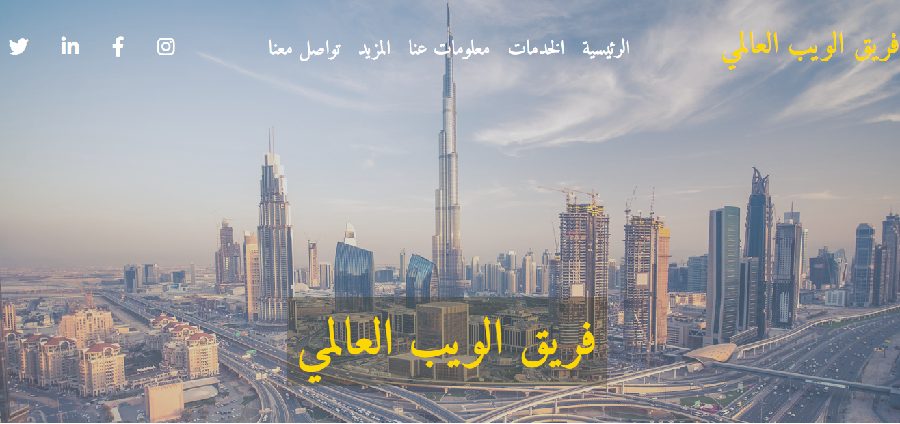

# Global Web Team 

<!-- ABOUT THE PROJECT -->

## About The Project
:smile:
***What I use :thinking: :*** 
- HTML 
- CSS

[Click Here](https://ranamaj.github.io/webteam/)

(<a href="#top">back to top</a>)

